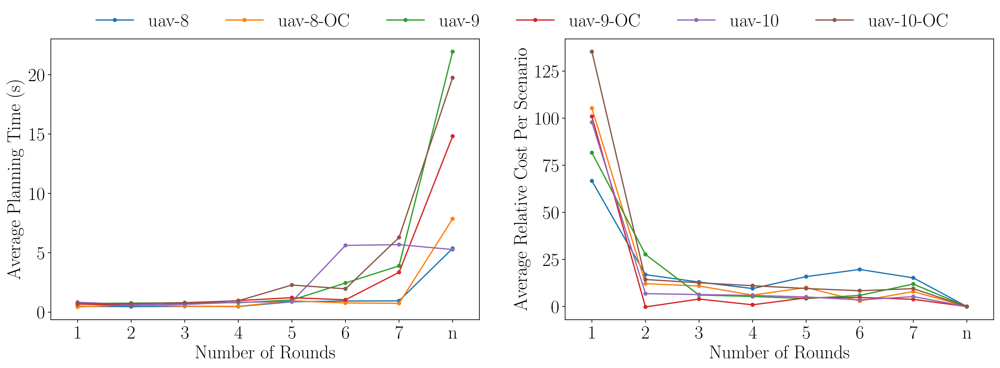
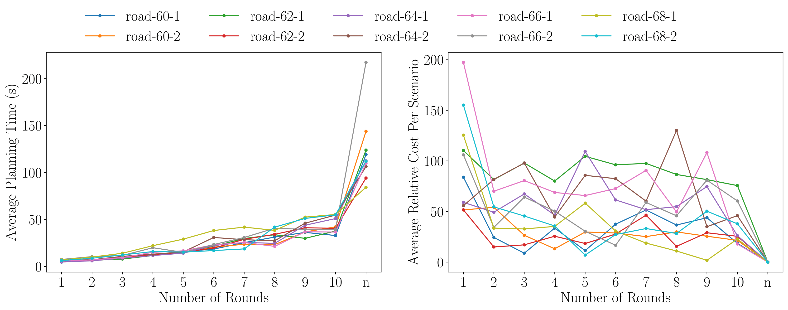

[](https://pubsonline.informs.org/journal/ijoc)

# Informative Path Planning with Limited Adaptivity

This archive is distributed in association with the [INFORMS Journal on
Computing](https://pubsonline.informs.org/journal/ijoc) under the [MIT License](LICENSE).

The software and data in this repository are a snapshot of the software and data
that were used in the research reported on in the paper 
[Informative Path Planning with Limited Adaptivity](https://doi.org/10.1287/ijoc.2024.0893) by R. Tan, R. Ghuge, V. Nagarajan. 
The snapshot is based on 
[this SHA](https://github.com/rayen-t/Informative-Path-Planning/commit/a7e48adeed872dedd78247e607950f6d59de09d2) 
in the development repository. 


## Cite

To cite the contents of this repository, please cite both the paper and this repo, using their respective DOIs.

https://doi.org/10.1287/ijoc.2024.0893

https://doi.org/10.1287/ijoc.2024.0893.cd

Below is the BibTex for citing this snapshot of the repository.

```
@misc{CacheTest,
  author =        {R. Tan, R. Ghuge, V. Nagarajan},
  publisher =     {INFORMS Journal on Computing},
  title =         {{Informative Path Planning with Limited Adaptivity}},
  year =          {2024},
  doi =           {10.1287/ijoc.2024.0893.cd},
  url =           {https://github.com/INFORMSJoC/2024.0893},
  note =          {Available for download at https://github.com/INFORMSJoC/2024.0893},
}  
```

## Description

This repository implements the limited adaptivity informative path planning algorithm found in our paper.

## Installing

Have a working installation of Python 3 and run the following command to install the dependencies.
```
pip install -r requirements.txt
```

## Results

Figure 3 in the paper shows the average planning time and average relative cost per scenario for UAV search instances.



Figure 4 in the paper shows the average planning time and average relative cost per scenario for California road network instances.



## Replicating
The unprocessed results can be generated by running
```
python IPP/main.py -p ${problemid} -k ${nrounds}
```
where ```problemid``` ranges from 0-25 and ```nrounds``` ranges from 1-10.

The notebook ```results_analyzer.ipynb``` processes the output to generate the plots.